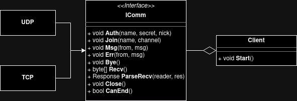

# IPK Project 1: IPK Calculator

## Table of Contents:
- [Summary of the Theory](#summary-of-the-theory)
    - [What is this app for?](#what-is-this-app-for)
    - [UDP](#udp)
    - [TCP](#tcp)
    - [Programmer work](#programmer-work)
- [Code overview](#code-overview)
    - [IComm interface](#icomm-interface)
    - [UDP & TCP classes](#udp--tcp-classes)
    - [Client class](#client-class)
- [Testing](#testing)
- [Extra functionality](#extra-functionality)
- [Bibliography](#bibliography)

## Summary of the Theory

### What is this app for?
This project implements a **client application**, which communicates with the
server using given protocol. The application implements communication using
two protocols: **UDP** and **TCP**.

### UDP:
**UDP** *(or User Datagram Procotol)* is communication protocol, that is very
common in internet communication.

This protocol uses **connectionless model** with a minimum of other protocol
mechanisms. This means that, for example, it doesn't require connection set up
prior the communication *(no handshake)*, which can lead to some
**unreliablity**, such as lost packets, wrong packet ordering *(might be*
*received in different order than they were send)*, duplicate messages and
more.

In order to detect errors, UDP uses **checksum**, which is a small block of
data in the message, that contains sum of all bits. To address different
functions, UDP uses **port numbers**.

On the other hand, because UDP doesn't implement all of the mentioned
mechanims, it is fast *(low latency)*. Some services need to be as fast as
possible and don't care about some lost packets, such as streaming, and so UDP
is perfect for this.

### TCP:
**TCP** *(or Transmission Control Protocol)* is also very common protocol for
internet communication.

This protocol, as opposed to UDP, provides **reliable**, ordered and
error-checked communication. TCP is **connection-oriented**, which means the
connection is established prior of sending messages. Some of the mechanisms TCP
uses are handshake, rentransmission of the messages and error detection.

Because TCP is reliable, it is used in services, that don't have to be that
fast *(can have longer latency)*, but rather reliable and correct, such as
World Wide Web, e-mail, file transfer and more.

### Programmer work:
From the programmer point of view, TCP is far easier. It is only needed to send
and receive messages and you don't have to care about all the protocol
mechanisms to aim for better reliability.

UDP on the other hand doesn't implement any of these and so to make UDP more
reliable, we're implementing some mechanisms, such as message confirmation and
automatic retransmission after certain time, in order to prevent packet
losses.

## Code overview:

Class diagram above shows basic overview of how I implemented the
communication and each network protocol.

### IComm interface
I created it in order to **abstract** TCP and UDP functionality. This way I
don't have to create Client for both TCP and UDP. This interface contains
method definitions for each message *(`Auth`, `Join`,...)*, that Client will be
able to send.

It also defines method for receiving *(`Recv`)* and for parsing received
message *(`ParseRecv`)*. Both UDP and TCP have to implement received messages
parsing, because they are in different formats.

There are also methods for closing the connection *(`Close`)* and for checking
whether communication can end *(`CanEnd`)*.

### UDP & TCP classes
They implement defined methods by `IComm` interface.

### Client class
When `Client` is being constructed, it is given parsed arguments and based on
that, `Client` desides whether to create `TCP` or `UDP` object.

Client contains only one public method and that is `Start`. This starts the
main loop of the client app. In the loop it handles user input and receives
messages by calling `Recv` method. When return value of `Recv` is not empty
array, it calls `ParseRecv` to handle the received message.

Client also implements user input parsing, because this is same for both TCP
and UDP. If the input is command that interacts with server, `Client` calls
corresponding `IComm` method.

## Testing:

### User input validation
Command arguments can contain only certain characters and can be only maximum
length long. So I tested by providing longer strings then expected and strings
containing not allowed characters.

### Retrasmits in UDP
To test this I stopped passing `CONFIRM` messages to UDP and replaced sending
to server with printing. This tested, whether maximum number of rentrasmits
work and whether the confirmation timeout timer works. I tested both with
different values.

### Sent messages format
Testing correct format of sent message is hard without implementing the server,
but I used Wireshark to look at the sent messages and compared its format to
expected format. I tried every message user can send.

## Extra functionality:
- `/clear`
    - Locally executed command for clearing the chat screen

## Bibliography
- [TCP in C#](https://learn.microsoft.com/en-us/dotnet/fundamentals/networking/sockets/tcp-classes)
- [UDP in C#](https://learn.microsoft.com/en-us/dotnet/api/system.net.sockets.udpclient?view=net-8.0)
- [Website for creating UML diagrams](https://app.diagrams.net/)
